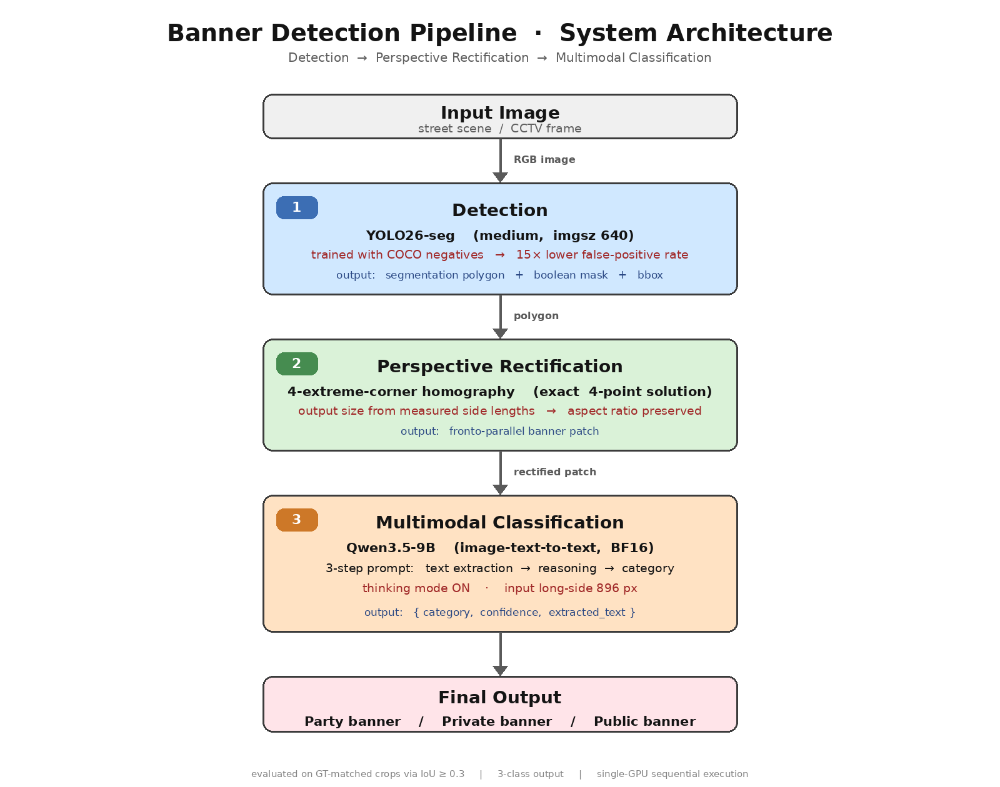

# 현수막 탐지·보정·분류 멀티모달 파이프라인

거리 현수막을 **픽셀 단위로 분리 → 원근 보정 → 멀티모달 VLM으로 종류 분류** 하는 3-단계 파이프라인입니다.

YOLO26-seg · 4점 Homography · Qwen3.5-9B



---

## 핵심 결과

| 지표 | 결과 |
|---|---|
| YOLO26-seg mAP@0.5 (banner val 534장) | **0.9772** (binary2) / 0.9803 (no_coco) |
| **일반 풍경 400장 오탐률** | **0.75%** (binary2) vs 11.25% (no_coco) — **15× 감소** |
| VLM 3-class 분류 정확도 (n=10) | **80.0%** — 공공 F1=1.00, 민간 F1=0.83 |

> **핵심 기여**: 공개 데이터셋(COCO)을 음성표본으로 추가 학습해 **거리 환경 오탐을 15배 억제**. 뒷단 VLM 호출 비용이 큰 실무 배포 조건에서 결정적 차이.

---

## 파이프라인 3단계

1. **탐지** — YOLO26-seg가 현수막을 픽셀 마스크(polygon)로 분리
2. **원근 보정** — polygon 4 극점 기반 Homography로 **정면 시점** 복원 (종횡비 보존)
3. **분류** — Qwen3.5-9B 멀티모달 VLM이 문구·로고·색상을 함께 고려해 **정당/민간/공공** 판별

---

## 요구 사항

- **NVIDIA GPU (≥ 24GB VRAM)** — Qwen3.5-9B BF16 로드 기준 (A5000 / A6000 / RTX 3090 / RTX 4090 등)
- Docker + Docker Compose + [nvidia-container-toolkit](https://docs.nvidia.com/datacenter/cloud-native/container-toolkit/latest/install-guide.html)
- 최초 실행 시 Qwen3.5-9B 가중치 약 **18GB** HuggingFace에서 자동 다운로드 → `.hf_cache/`에 캐시됨

---

## 빠른 시작 (단일 이미지 추론)

### 1. 컨테이너 기동
```bash
git clone https://github.com/aliceq13/banner-detection-pipeline.git
cd banner-detection-pipeline
docker compose up -d
```

### 2. 학습된 YOLO 가중치 내려받기
```bash
mkdir -p results/models
curl -L -o results/models/yolo26_banner_best.pt \
    https://github.com/aliceq13/banner-detection-pipeline/releases/download/v1.0/binary2-best.pt
```

### 3. 현수막 사진 한 장을 `sample.jpg`로 저장 후 실행
```bash
# 본인의 거리 현수막 사진을 sample.jpg 로 저장
docker compose exec banner-project python 04_pipeline.py \
    --image sample.jpg --visualize
```

최초 실행 시 Qwen3.5-9B 다운로드(~18GB, 10~20분)가 진행됩니다. 이후 실행은 캐시에서 즉시 로드됩니다.

결과:
- 콘솔에 카테고리(정당/민간/공공) + 신뢰도 + 근거 출력
- `results/pipeline_output/` 에 시각화 이미지 (`--visualize` 지정 시)

### VLM 없이 탐지·보정만 돌려보기 (GPU 메모리 부족 시)
```bash
docker compose exec banner-project python 04_pipeline.py \
    --image sample.jpg --visualize --no-vlm
```

---

## 원본 평가 재현 (원천 데이터셋 필요)

`05_demo.py`는 COCO JSON 형식의 GT 카테고리 레이블이 포함된 **원천 `illegal_banner` 데이터셋**이 있어야 동작합니다 (`load_gt_labels`가 `config.COCO_BANNER_LBL` 경로의 JSON을 읽기 때문). 데이터셋이 준비돼 있다면:

1. `docker-compose.yml`에서 `# - /path/to/illegal_banner:/workspace/illegal_banner:ro` 주석 해제 + 실제 경로 반영
2. `docker compose up -d --force-recreate`
3. `docker compose exec banner-project python 05_demo.py --n-samples 50`

결과는 `results/demo/` 에 저장됩니다:
- `pipeline_demo.png` — 6 샘플 정성 비교
- `vlm_confusion_matrix.png` — 3-class 혼동행렬
- `evaluation_report.md` — 정량 요약

상세 실행 절차는 [USAGE.md](USAGE.md) 참조.

---

## 저장소 구성

| 파일 | 설명 |
|---|---|
| [`USAGE.md`](USAGE.md) | **실행 가이드** — 코드 진입점 분석 + 단계별 명령 |
| [`report_1.md`](report_1.md) | **최종 보고서** — 실험·결과·분석 상세 |
| [`presentation.md`](presentation.md) | Gamma 슬라이드용 마크다운 |
| [`script.md`](script.md) | 10분 발표 대본 |
| `01_prepare_data.py` | COCO 다운로드 + 병합 데이터셋 생성 (**원천 데이터셋 필요**) |
| `02_train_yolo.py` | YOLO26-seg 학습 |
| `03_evaluate_yolo.py` | YOLO val/test 평가 |
| `04_pipeline.py` | 단일/배치 이미지 E2E 파이프라인 (**이미지만 있으면 동작**) |
| `05_demo.py` | GT 매칭 기반 VLM 정량 평가 + 정성 그리드 (**원천 데이터셋 필요**) |
| `config.py` | 전역 설정 (경로·하이퍼파라미터·VLM 옵션) |

---

## 기술 스택

| 단계 | 기술 |
|---|---|
| 탐지 | YOLO26-seg (ultralytics) |
| 원근 보정 | OpenCV Homography (`getPerspectiveTransform`) |
| 분류 | Qwen/Qwen3.5-9B (BF16, thinking mode ON) |
| 인프라 | Docker Compose · PyTorch 2.4 · CUDA 12.1 |
| 시각화 | matplotlib · seaborn · PIL |

---

## 릴리스

- [v1.0](https://github.com/aliceq13/banner-detection-pipeline/releases/tag/v1.0) — YOLO26-seg 학습 가중치
  - `binary2-best.pt` — COCO 음성표본 포함 학습 (권장)
  - `no_coco-best.pt` — Ablation 비교용 (COCO 미포함)

---

## 라이선스

본 저장소의 코드는 학술·연구 목적의 중간고사 프로젝트 결과물입니다. 원천 데이터셋(`illegal_banner`, COCO)은 각각의 원 라이선스를 따릅니다.
